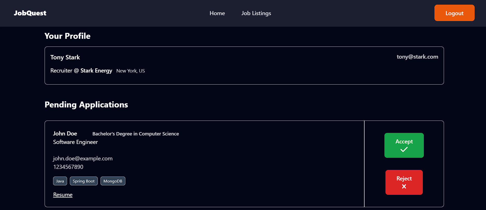

# JobQuest

JobQuest is a 'Job Portal' web application made using Java Spring Boot and ReactJS.

## Table of Contents

- [Screenshots](#screenshots)
- [Features](#features)
- [Technologies Used](#technologies-used)
- [Running the Project Locally](#running-the-project-locally)


### Screenshots


---


---



## Features

- Candidates can:
  - Apply to posted jobs
  - Track their job applications' status
- Recruiters can:
  - Post and delete jobs
  - Accept or reject job applications from candidates

## Technologies Used

### Frontend

- [React](https://react.dev/)
- [TailwindCSS](https://tailwindcss.com/) for styling
- [Axios](https://axios-http.com/docs/intro)
- [Redux Toolkit (RTK)](https://redux-toolkit.js.org/)
- [Redux Persist](https://redux-toolkit.js.org/rtk-query/usage/persistence-and-rehydration)

### Backend

- [Spring Boot](https://spring.io/projects/spring-boot)
- [Spring Security](https://spring.io/projects/spring-security)
- [Spring Data JPA](https://spring.io/projects/spring-data-jpa)
- [MySQL](https://www.mysql.com/) for relational data persistence

## Running the Project Locally

These instructions will help you set up a copy of the project on your local machine.

### Prerequisites

Before getting started, make sure you have the following installed on your machine:

- [Node.js version 18.15.0 (or higher)](https://nodejs.org)
- [JDK (Java Development Kit) 17](https://www.oracle.com/in/java/technologies/downloads/#java17)
- [Maven](https://maven.apache.org/download.cgi)
- [MySQL](https://dev.mysql.com/downloads/installer/) (running with user credentials configured in `application.properties`)

### Installing & Usage

1. Clone the repository to your local machine:

   ```bash
   git clone https://github.com/SaiKrishnaKapa/job-quest-java
   cd job-quest-java
   ```

2. Navigate to the backend directory `jobquestbackend` & open it in your Spring Boot IDE (IntelliJ IDEA recommended).

3. Sync Maven dependencies.

4. Set up your database:
   - Create a database named `jobquest`
   - Update `src/main/resources/application.properties` with your MySQL username/password

5. Start the backend server:

   ```bash
   mvn spring-boot:run
   ```

   The server runs on [http://localhost:8080](http://localhost:8080)

   You can test API endpoints like:  
   [http://localhost:8080/api/v1/jobs](http://localhost:8080/api/v1/jobs)

6. Now navigate to the frontend directory and install dependencies:

   ```bash
   npm install
   ```

7. Run the frontend development server:

   ```bash
   npm run dev
   ```

   Access the web app at [http://localhost:5173](http://localhost:5173)

### Contribute

If you encounter any issues, have suggestions, or want to contribute, feel free to open an issue or submit a pull request. Happy coding!